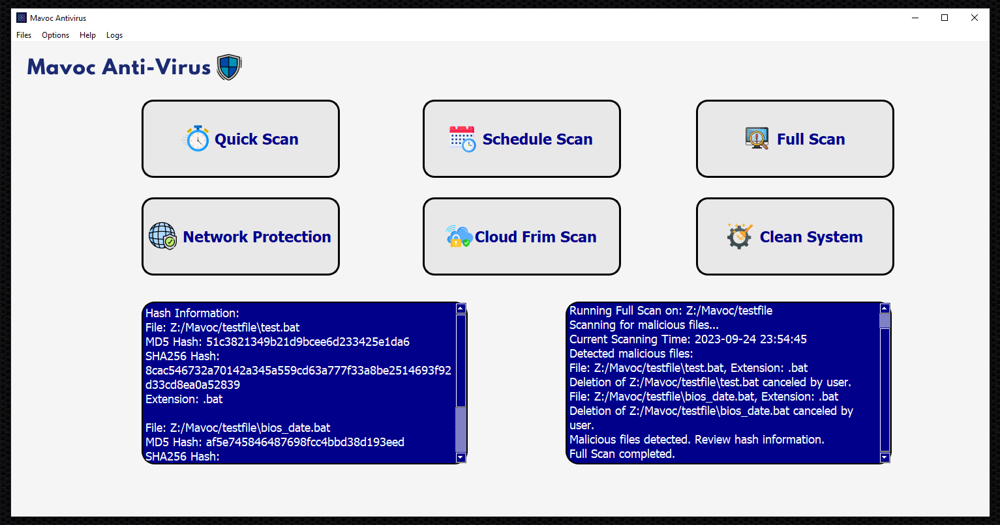
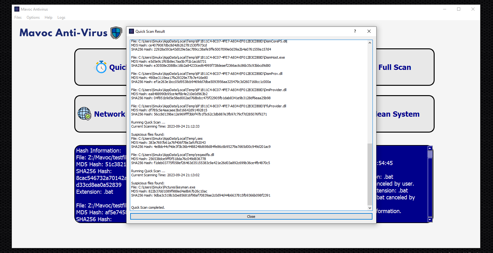
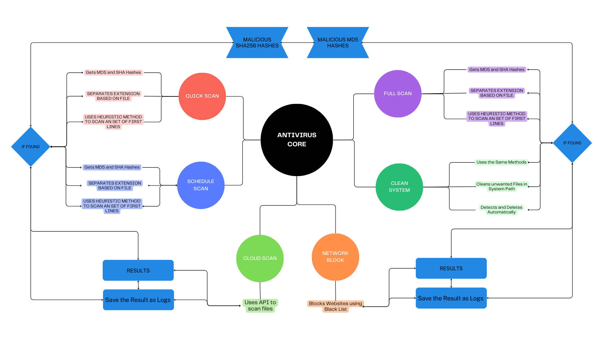
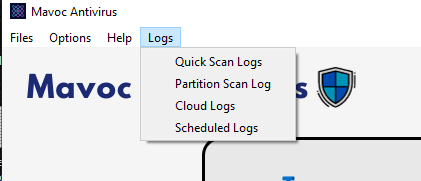
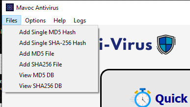

<div align="center">
  
  <h1>Mavoc Antivirus</h1>

  <br>

  <p><i> An opensource antivirus tool that scans, analyze and removes malware, Torjans, payloads, botnets, Ransomware, etc
  <br>
    Created in QT and python by<a href="https://twitter.com/Smukx07"> @Smukx</a> .</i></p>
  <br />
  
  
  
  <b><i>Antivirus password : mavoc</i></b>
</div>
<br>

>  :warning: The tool is in its early developmental stage. The Heuristic method is still under development. It will come with a new feature in the next update.


## Working Methodology

<div align="center">
  
  <br/>
  Flowchart for working methodology
  <br>
  </div>
 
**Scans files using Hashing algorithms with the latest database collections such as sha256 and md5 hashes (MOST REQUESTED).**

**Uses Heuristic Method to Scan 1st Set of Lines (MOST REQUESTED)**
  
**Scans files using malicious extensions over 900+ popular malicious extensions (MOST REQUESTED)**

**Saves all the results in a separate log file (MOST REQUESTED)**

**Can used to Delete malicious files with your Permission only (analyse (MOST REQUESTED FOR ANALYSING)** 

**Network Protection Restricts Malicious Websites over 46000 Websites**


## Types of Scans

**There are 6 Types of Scans** 

> 💁‍♂️ Tips : Before running the Quick Scan . Please run the Clean System Option to Make the Quick Scan as Fast as possible . Because it even scans inside Temp files . So in order to make it good. Run Clean System Option .


<!---
- Quick Scan
- Schedule Scan 
- Full Scan
- Network Blocker
- Cloud Firm Scan
- Clean System
--->

<details>
  <summary><b>Quick Scan </b></summary>
  <p><b>There are 2 types of Scans, Quick Recursive and Non-Recursive Scan.</b></p>
  <p>Quick Recursive Scan will scan all files recursively in the common paths, even inside temporary files and folders within the common directory path. </p>
  <p>Quick Non-Recursive scan will simply look for common places where malware, payloads, etc., may be stored.</p>
</details>

<details>
  <summary><b>Schedule Scan </b></summary>
  <p>To initiate a Schedule Scan with Mavoc Antivirus, you need to start the Mavoc Antivirus application mavoc.ps1 instead of starting the framework.py by.</p>
  <p>By Default the summary scan will download and install modules
  <p>Schedule Scan will scan and completely remove malicious files on a common path every 1 minute by default, but you can adjust the timing in the mavoc.ps1 script.</p>
</details>

<details>
  <summary><b>Full Scan </b></summary>
  <p><b>There are Two Types of Scans: Full Scan and Partition Scan.</b></p>
  <p>Full Scan will comprehensively scan your entire system, which may take hours, so please be patient when using this option.</p>
  <p>Partition Scan allows you to select a particular partition or folder to scan files recursively, making it the fastest scanning method.</p>
</details>

<details>
  <summary><b>Network </b></summary>
  <p>Network Protection contains a list of more than 42,000 malicious sites. When enabled, it blocks access to these sites. You can reset it to the default settings by choosing to disable the network blocker.</p>
</details>

<details>
  <summary><b>Cloud Firm Scan </b></summary>
  <p>This scan utilizes the VIRUS TOTAL API to scan a specific file.</p>
  <p>Important Note: If you are using the free VIRUS TOTAL API, limit your scans to a minimum of 3 files per minute.</p>
</details>

<details>
  <summary><b>Clean System </b></summary>
  <p>Clean System is used to remove unwanted files from common directory paths, such as temporary and registry paths. It automatically deletes these files to optimize system performance and enhance security.</p>
</details>

#### FEATURES

<details>
  <summary><b>Log Viewer</b></summary>
  
  <b>You can view log files on the menu bar</b>
  
  <div align="center">
  <p align="Left">Log Viewer is used to view the logs of recent Scans and the results of scans like malicious files detected and the files that are removed from the system after approval from the user. These logs will be recorded while the scanning process is going on along with the date and time of the scan. This helps to get some detailed data on malicious that entered our system and the Files that are removed for security purposes. </p>
  
  </div>
</details>

<details>
  <summary><b>Add Database</b></summary>
  <p>You can create your own databases. Now, by default, it has over 350000 New, Popular Databases Till 24 SEP 2023 </p>
  <p>To add your custom database, the hash files are located in the /hashes directory. or you can add the database through the File options available on the menu_bar</p>
  <div align="center">
  
  </div>  
</details>

## Installation 

**An short video of installation**

[](https://www.youtube.com/watch?v=yIzGXEaWj_Y)

Install the requirements. `pip3 install -r requirements.txt`.

**NOTE:: Execute the program on Administrator .**

<h4>Method 1 [Autoinstall Program]</h4>

For Autoinstall use the following link 

**NOTE : RUN THIS COMMNAD IN POWERSHELL ADMINISTRATOR SHELL**

```
wget 'https://github.com/Whitecat18/Mavoc-Antivirus/releases/download/v1.1.0/install.py' -O install.py ; python3 install.py 
```

<h4>Method 2 [Manual Methods]</h4>

**Download from Main Branch**

```
git clone https://github.com/Whitecat18/Mavoc-Antivirus.git 
[or]
wget https://codeload.github.com/Whitecat18/Mavoc-Antivirus/zip/refs/heads/main
cd Mavoc-Antivirus
pip3 install -r requirements.txt
start-process powershell.exe -Verb RunAs
python3 mavoc.py
```

**Download from Releases **

```
wget https://github.com/Whitecat18/Mavoc-Antivirus/releases/download/v1.1.0/Mavoc-Antivirus-main.zip
cd Mavoc-Antivirus
pip3 install -r requirements.txt
start-process powershell.exe -Verb RunAs
cd C:\\<MAVOC-DIRECTORY>\ # GO TO MAVOC-ANTIVIRUS DIRECTORY 
python3 mavoc.py
```

### _Password_ : **_mavoc_**

> 🥇 RUN THE mavoc.py to start all Functions of program.

REPLACE your API key for virus total, cloud scans, search  `api_key` on framework.py and replace it with your virus total API

To set custom hashes for scanning. visit the release to download the required hashes for your needs! 

> **Warning** ⚠️ Schedule scan will delete all the files without asking permission from the user. so be careful when you operate the scheduled scan. By default, I have added the safer, malicious paths alone.  

#### Customization

<details>
  <summary><b>Setting up HASH for Scanning</b></summary>
  <br>
  <p>I have Collected Popular Databases from various popular sources in the Dark Web, VX-Underground Group, etc .. </p>
  <p>At this date over 700 K Popular SHA256 and 1 million MD5 Hashes of virus database has been added. </p>
  <p>I Have Two Files, the fast_md5 and fast_sha256 hashes have been added to the hashes folder. By default, 350K Popular hashes have been added </p>
</details>

<details>
  <br>
  <summary><b>Setting Path for Quick Scanning</b></summary> 
  <p>On Line 1828 or Search `DIRECTORY PATH FOR QUICK SCAN` on the framework.py. you can add your own directory for scanning .</p>
</details>

<details>
  <summary><b>Custom BlackList Configuration</b></summary>
  <p>You can customize the blacklist file to block sites that performed some malicious activity 
By default, it has over 46000 Malicious and scamming sites.</p>
</details>

<details>
<summary><b>Setting Path for Schedule Scan</b></summary>
<p>You can customize the path for the scheduled scan. edit the schedule-scanning.py , search <b>`# PATH FOR SCHEDULE SCANNING`</b> in the directories_to_scan = 
  [] Add the following path for your needs.</p>
</details>

####  UPDATES .., 

Updates are on the way, The Update Option will be available when the new version is on it. 

- [X] Mavoc Beta -> 1.0.0
- [X] Mavoc Installer (CLI)
- [ ] Mavoc Installer GUI ( With .dll pakage Files )
- [ ] Heuristic Advance Logic Implementation
- [ ] Additional features to Network Protection


#### Contribution 

Everyone can contribute to this software, I will verify, test, and merge it.  

<i> Special thanks to Phoenix for helping me with the Design Layouts and Network Protection module 🍀 </i>
